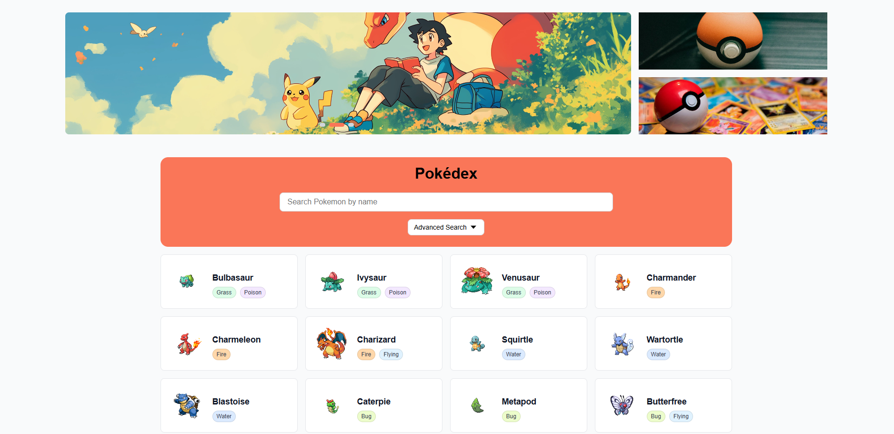
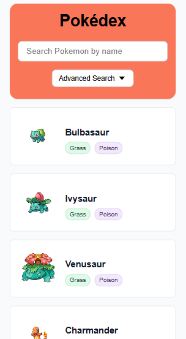
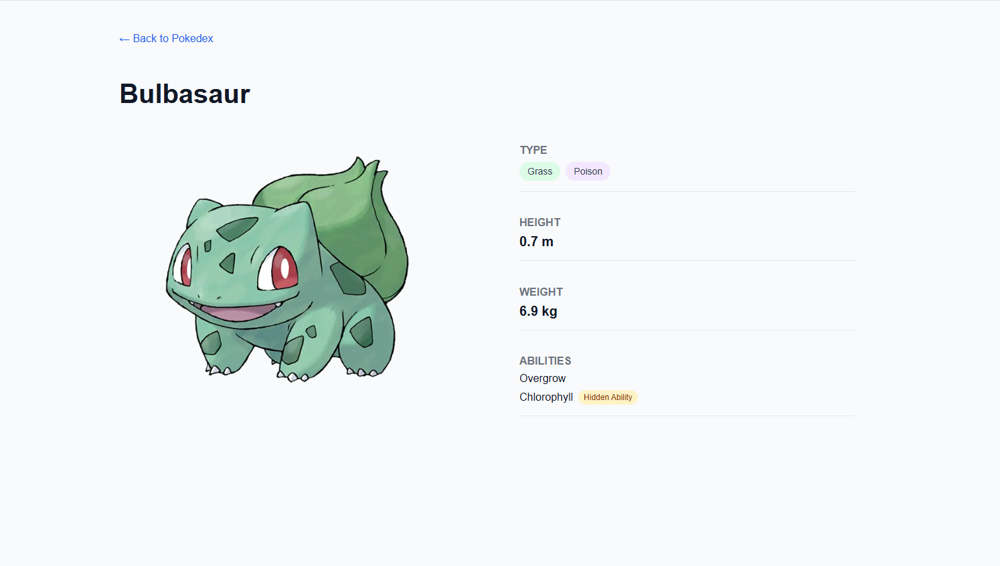

# Pokedex Project

This is a Next.js Pokedex website that uses a Node.js/Express backend API that fetches Pokémon data from the PokéAPI.
Features include search, load more, Pokémon types with coloured badges and a responsive UI with carousel and static banners.

## Screenshots

### Desktop View



### Mobile View

<p align="center">
  
</p>

### Individual Pokemon Page



## 1. Setup instructions

- Make sure that you already have **Git** and **Node.js** (this includes **npm**) installed on your computer to clone and run this application on your device.

  ## 1. Clone the repository

  ```
  git clone https://github.com/JKLee02/pokedex-project.git
  ```

  ## 2. Go into the repository

  ```
  cd pokedex-project
  ```

  ## Frontend

  ### 1. Install the dependencies for frontend

  ```
  cd frontend
  npm install
  ```

  ### 2. Run the development server

  ```
  npm run dev
  ```

  ## Backend

  ### 1. Install the dependencies for backend

  ```
  cd backend
  npm install
  ```

  ### 2. Start the backend server

  ```
  node server.js
  ```

## 2. API Documentation

## Overview

The Pokedex backend API provides Pokémon data fetched from the [PokéAPI](https://pokeapi.co/).
It supports pagination and returns Pokémon details including name, image, types, height, and weight.

The API is then utilized by the Next.js frontend to display Pokémon with search and load more functionality.

**Base URL**

```
http://localhost:3001/api
```

## Endpoint

Used to fetch a list of Pokémon with pagination.

```
GET /pokemons
```

### Query Parameters

| Parameter | Type    | Default | Description                |
| --------- | ------- | ------- | -------------------------- |
| `page`    | integer | 1       | Page number to fetch       |
| `limit`   | integer | 36      | Number of Pokémon per page |

**Example Request**

```
GET http://localhost:3001/api/pokemons?page=1&limit=36
```

**Successful Response in JSON**

```
{
  "pokemon": [
    {
      "name": "bulbasaur",
      "image": "https://raw.githubusercontent.com/PokeAPI/sprites/master/sprites/pokemon/other/official-artwork/1.png",
      "types": [
        "grass",
        "poison"
      ],
      "height": 7,
      "weight": 69
      "abilities": [
        {
          "name": "overgrow",
          "is_hidden": false
        },
        {
          "name": "chlorophyll",
          "is_hidden": true
        }
      ]
    },
    ...
  ],
  "page": 1,
  "limit": 36,
  "hasMore": true
}
```

### Response fields

| Field            | Type    | Description                                      |
| ---------------- | ------- | ------------------------------------------------ |
| `pokemon`        | array   | List of Pokémon objects                          |
| `pokemon.name`   | string  | Pokémon's name                                   |
| `pokemon.image`  | string  | URL to Pokémon image                             |
| `pokemon.types`  | array   | Pokémon types (may have multiple)                |
| `pokemon.height` | integer | Height of Pokémon (in decimetres)                |
| `pokemon.weight` | integer | Weight of Pokémon (in hectograms)                |
| `abilities`      | array   | Abilities of Pokémon (includes hidden abilities) |
| `page`           | integer | Current page number                              |
| `limit`          | integer | Number of Pokémon per page                       |
| `hasMore`        | boolean | Indicates if more Pokémon are available to fetch |

### Error Response

```
{
  "error": "Failed to fetch Pokémon"
}
```

### Example Usage (in JavaScript)

```
async function getPokemon() {
  try {
    const response = await fetch('http://localhost:3001/api/pokemons?page=1&limit=36');
    const data = await response.json();
    console.log(data.pokemon);
  } catch (error) {
    console.error("Error fetching Pokémon:", error);
  }
}
getPokemon();
```

## Demo Link

Note: The pokemon data may take a few minutes to appear when running it for the first time due to the Render's free tier.

https://pokedex-project123.vercel.app/
